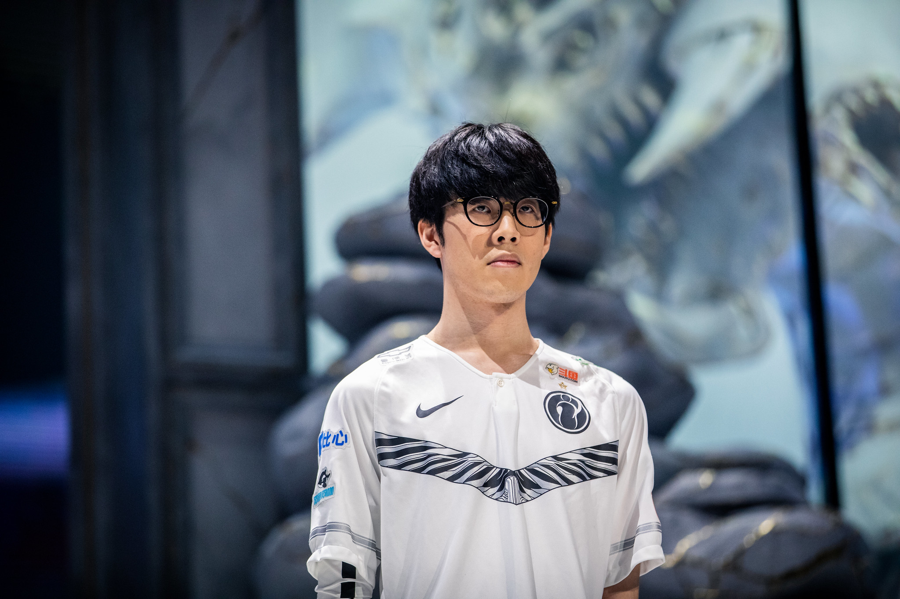

# About Me

### Charles Ting
Born on December 22, 1999 and attended Troy High School before deciding to major in Computer Science at UCSD.
**Since my dream is to be a programmer, I take my studies very seriously. I wish to learn all I can about the sofware development and be the best version of myself.**

### Inspiration
As Kobe Bryant once said:

> Everything negative - pressure, challenges - is all an opportunity for me to rise. 

**My mother and father are also inspirations. They emigrated from Taiwan to America to find a better life**

### Journey
From being barely able to understand `System.out.println("Hello World");`, I now work on projects ranging from machine learning to app development.

### Miscellaneous Info
I spend my free time playing video games with my friends, watching anime, or just hanging out and grabbing food (pre-covid). I also watch professional e-sports and all sorts of professional sports (basketball, football, and baseball).
Check out my [March Madness Bracket](https://bracketchallenge.ncaa.com/picks/group/1066805?cid=bcg2021_marketing_wyng).

Some of my fav animes:
- Oregairu
- Full Metal Alchemist Brotherhood
- Hyouka
- Bungo Stray Dogs

I love discussing basketball with my friends. My top 10 NBA players right now are:
1. Lebron James
2. Kevin Durant
3. Giannis Antetokounmpo
4. James Harden
5. Stephen Curry
6. Nikola Jokic
7. Kawhi Leonard
8. Anthony Davis
9. Luka Doncic
10. Damian Lillard

Check out my [README](README.md). Right now it is empty, but it will probably fill out as the quarter progresses.

I also listen to k-pop some of my most listened to groups are: 
- [Red Velvet](https://www.youtube.com/watch?v=J_CFBjAyPWE)
- [Big Bang](https://www.youtube.com/watch?v=AqCvYLcnVu0)
- BTS
- Exo
- Day6
- [Winner](https://www.youtube.com/watch?v=GZaIiE4AeSU)

Some of my goals I set this year:
- [x] Find an internship
- [ ] Get good grades
- [x] Get the COVID vaccine
- [ ] Got to a concert